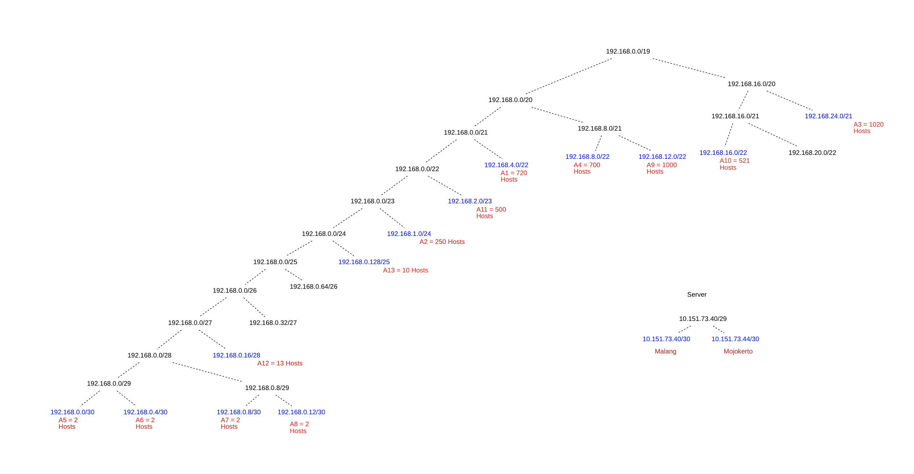
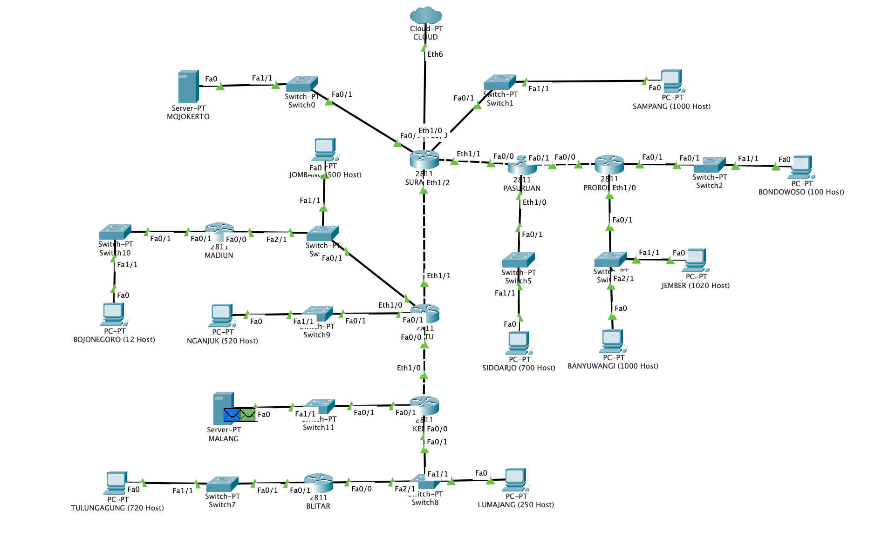
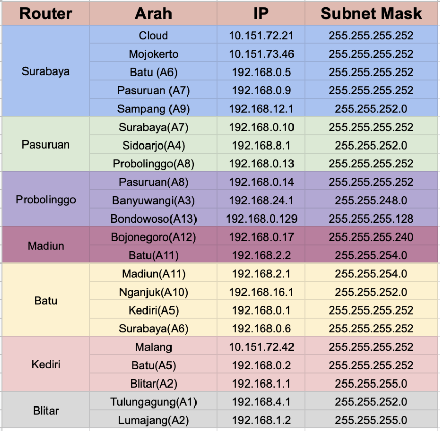
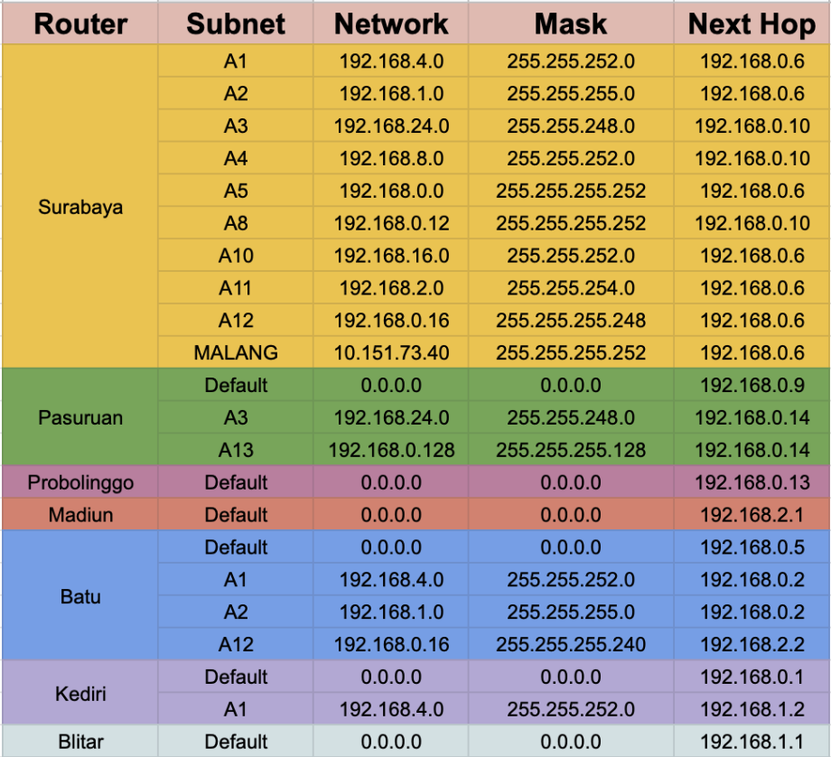

# Jarkom_Modul4_Lapres_A04
Lapres Jarkom Modul 4 A04

Kelompok A04:
-
#### I Gusti Agung Chintya Prema Dewi   (05111840000130)
#### Kholilah Zaki Lismia               (05111840000159)

## Penyelesaian
Kelompok A04 menggunakan VLSM pada CPT dan CIDR pada UML.

### VLSM
---------------------------------
### Subnetting
  1. Melakukan subnetting pada topologi yang diberikan. Sehingga terbentuklah 13 subnet di dalam topologi seperti pada gambar berikut.
  

  2. Menentukan jumlah alamat IP yang dibutuhkan oleh tiap subnet dan lmelakukan labelling netmask berdasarkan jumlah IP yang dibutuhkan.
      | Subnet      | Jumlah IP   | Netmask |
      | ----------- |         ---:| ------- |
      | A1          | 721         | /22     |
      | A2          | 252         | /24     |
      | A3          | 13          | /28     |
      | A4          | 502         | /23     |
      | A5          | 521         | /22     |
      | A6          | 2           | /30     |
      | A7          | 2           | /30     |
      | A8          | 2           | /30     |
      | A9          | 701         | /22     |
      | A10         | 2           | /30     |
      | A11         | 2021        | /21     |
      | A12         | 101         | /25     |
      | A13         | 1001        | /22     |
      | Total       | 5841        | /19     |
      
      Berdasarkan total IP dan netmask yang dibutuhkan, maka dapat menggunakan netmask /19 untuk memberikan pengalamatan IP pada subnet.
  3.  Subnet besar yang dibentuk memiliki NID 192.168.0.0 dengan netmask /19. Selanjutnya menghitung pembagian IP berdasarkan NID dan netmask tersebut menggunakan pohon seperti gambar berikut.
      

### CPT

   1. Membuat topologi pada CPT
        
   2. Mengatur IP untuk masing masing interface yang ada disetiap device sesuai dengan pembagian subnet pada pohon VLSM.
        
   3. Melakukan Routing pada setiap router
        
        
      
### CIDR
-----------------------------

### Subnetting

1. Tentukan subnet yang ada dalam topologi dan lakukan labelling netmask terhadap masing-masing subnet seperti berikut
<p align="center"></p><br>

<p align="center"></p><br>

<p align="center"></p><br>

<p align="center"></p><br>

<p align="center"></p><br>

<p align="center"></p><br>

<p align="center"></p><br>

2. Dari proses tersebut didapatkan subnet besar dengan NID 192.168.0.0 dengan netmask /16.
3. Hitung pembagian IP dengan pohon berdasarkan penggabungan subnet yang telah dilakukan.


4. Lalu lakukan routing dengan pembagian sebagai berikut


### Praktik pada UML
1. Buatlah topologi seperti berikut
```
#Switch
uml_switch -unix switch0 > /dev/null < /dev/null &
uml_switch -unix switch1 > /dev/null < /dev/null &
uml_switch -unix switch2 > /dev/null < /dev/null &
uml_switch -unix switch3 > /dev/null < /dev/null &
uml_switch -unix switch4 > /dev/null < /dev/null &
uml_switch -unix switch5 > /dev/null < /dev/null &
uml_switch -unix switch6 > /dev/null < /dev/null &
uml_switch -unix switch7 > /dev/null < /dev/null &
uml_switch -unix switch8 > /dev/null < /dev/null &
uml_switch -unix switch9 > /dev/null < /dev/null &
uml_switch -unix switch10 > /dev/null < /dev/null &
uml_switch -unix switch11 > /dev/null < /dev/null &
uml_switch -unix switch12 > /dev/null < /dev/null &
uml_switch -unix switch13 > /dev/null < /dev/null &
uml_switch -unix switch14 > /dev/null < /dev/null &

# Router
xterm -T SURABAYA -e linux ubd0=SURABAYA,jarkom umid=SURABAYA eth0=tuntap,,,10.151.73.21 eth1=daemon,,,switch1 eth2=daemon,,,switch2 eth3=daemon,,,switch7 eth4=daemon,,,switch0 mem=64M &
xterm -T PASURUAN -e linux ubd0=PASURUAN,jarkom umid=PASURUAN eth0=daemon,,,switch2 eth1=daemon,,,switch3 eth2=daemon,,,switch8 mem=64M &
xterm -T PROBOLINGGO -e linux ubd0=PROBOLINGGO,jarkom umid=PROBOLINGGO eth0=daemon,,,switch3 eth1=daemon,,,switch4 eth2=daemon,,,switch9 mem=64M &
xterm -T BATU -e linux ubd0=BATU,jarkom umid=BATU eth0=daemon,,,switch7 eth1=daemon,,,switch11 eth2=daemon,,,switch10 eth3=daemon,,,switch6 mem=64M &
xterm -T MADIUN -e linux ubd0=MADIUN,jarkom umid=MADIUN eth0=daemon,,,switch6 eth1=daemon,,,switch5 mem=64M &
xterm -T KEDIRI -e linux ubd0=KEDIRI,jarkom umid=KEDIRI eth0=daemon,,,switch11 eth1=daemon,,,switch14 eth2=daemon,,,switch12 mem=64M &
xterm -T BLITAR -e linux ubd0=BLITAR,jarkom umid=BLITAR eth0=daemon,,,switch14 eth1=daemon,,,switch13 mem=64M &

# Server
xterm -T MOJOKERTO -e linux ubd0=MOJOKERTO,jarkom umid=MOJOKERTO eth0=daemon,,,switch0 mem=64M &
xterm -T MALANG -e linux ubd0=MALANG,jarkom umid=MALANG eth0=daemon,,,switch12 mem=64M &

# Klien
xterm -T SAMPANG -e linux ubd0=SAMPANG,jarkom umid=SAMPANG eth0=daemon,,,switch1 mem=64M &
xterm -T BONDOWOSO -e linux ubd0=BONDOWOSO,jarkom umid=BONDOWOSO eth0=daemon,,,switch4 mem=64M &
xterm -T JEMBER -e linux ubd0=JEMBER,jarkom umid=JEMBER eth0=daemon,,,switch9 mem=64M &
xterm -T BANYUWANGI -e linux ubd0=BANYUWANGI,jarkom umid=BANYUWANGI eth0=daemon,,,switch9 mem=64M &
xterm -T SIDOARJO -e linux ubd0=SIDOARJO,jarkom umid=SIDOARJO eth0=daemon,,,switch8 mem=64M &
xterm -T JOMBANG -e linux ubd0=JOMBANG,jarkom umid=JOMBANG eth0=daemon,,,switch6 mem=64M &
xterm -T BOJONEGORO -e linux ubd0=BOJONEGORO,jarkom umid=BOJONEGORO eth0=daemon,,,switch5 mem=64M &
xterm -T NGANJUK -e linux ubd0=NGANJUK,jarkom umid=NGANJUK eth0=daemon,,,switch10 mem=64M &
xterm -T LUMAJANG -e linux ubd0=LUMAJANG,jarkom umid=LUMAJANG eth0=daemon,,,switch14 mem=64M &
xterm -T TULUNGAGUNG -e linux ubd0=TULUNGAGUNG,jarkom umid=TULUNGAGUNG eth0=daemon,,,switch13 mem=64M &
```

2. Pada UML, setting interface pada setiap UML dengan menjalankan perintah `nano /etc/network/interfaces` kemudian restart network dengan perintah `service networking restart`. Untuk UML yang merupakan router, juga harus di-uncomment pada perintah net.ipv4.ip_forward=1 pada file sysctl.conf, dapat dibuka dengan mengetikkan `nano /etc/sysctl.conf` dan untuk restart gunakan `sysctl -p`. Jangan lupa di setiap UML yang merupakan router buatlah file iptables.sh yang berisi `iptables –t nat –A POSTROUTING –o eth0 –j MASQUERADE –s 192.168.0.0/16` dan jalankan iptables setelah konfigurasi interface selesai dengan perintah `bash iptables.sh`. Berikut setting file /etc/network/interfaces untuk setiap UML:

**SURABAYA**
<p align="center"></p><br>

<p align="center"></p><br>

**PASURUAN**
<p align="center"></p><br>

**PROBOLINGGO**
<p align="center"></p><br>

**BATU**
<p align="center"></p><br>

<p align="center"></p><br>

**MADIUN**
<p align="center"></p><br>

**KEDIRI**
<p align="center"></p><br>

**BLITAR**
<p align="center"></p><br>

**MOJOKERTO**
<p align="center"></p><br>

**MALANG**
<p align="center"></p><br>

**SAMPANG**
<p align="center"></p><br>

**BONDOWOSO**
<p align="center"></p><br>

**JEMBER**
<p align="center"></p><br>

**BANYUWANGI**
<p align="center"></p><br>

**SIDOARJO**
<p align="center"></p><br>

**JOMBANG**
<p align="center"></p><br>

**BOJONEGORO**
<p align="center"></p><br>

**NGANJUK**
<p align="center"></p><br>

**LUMAJANG**
<p align="center"></p><br>

**TULUNGAGUNG**
<p align="center"></p><br>

3. Untuk routing, masukkan konfigurasi sebagai berikut pada `route.sh` agar saat UML di restart konfigurasi untuk routing tidak hilang
- Surabaya
```
route add -net 192.168.128.0 netmask 255.255.192.0 gw 192.168.192.2
route add -net 192.168.0.0 netmask 255.255.224.0 gw 192.168.32.2
route add -net 10.151.73.44 netmask 255.255.255.252 gw 192.168.32.2
```

- Batu
```
route add -net 192.168.0.0 netmask 255.255.248.0 gw 192.168.8.2
route add -net 192.168.18.0 netmask 255.255.255.240 gw 192.168.16.2
route add -net 10.151.73.44 netmask 255.255.255.252 gw 192.168.8.2
```

- Kediri
```
route add -net 192.168.0.0 netmask 255.255.252.0 gw 192.168.4.2
```

- Pasuruan
```
route add -net 192.168.128.0 netmask 255.255.240.0 gw 192.168.144.2
```

Untuk menjalankan route.sh, bisa dengan menggunakan perintah `source route.sh`.
